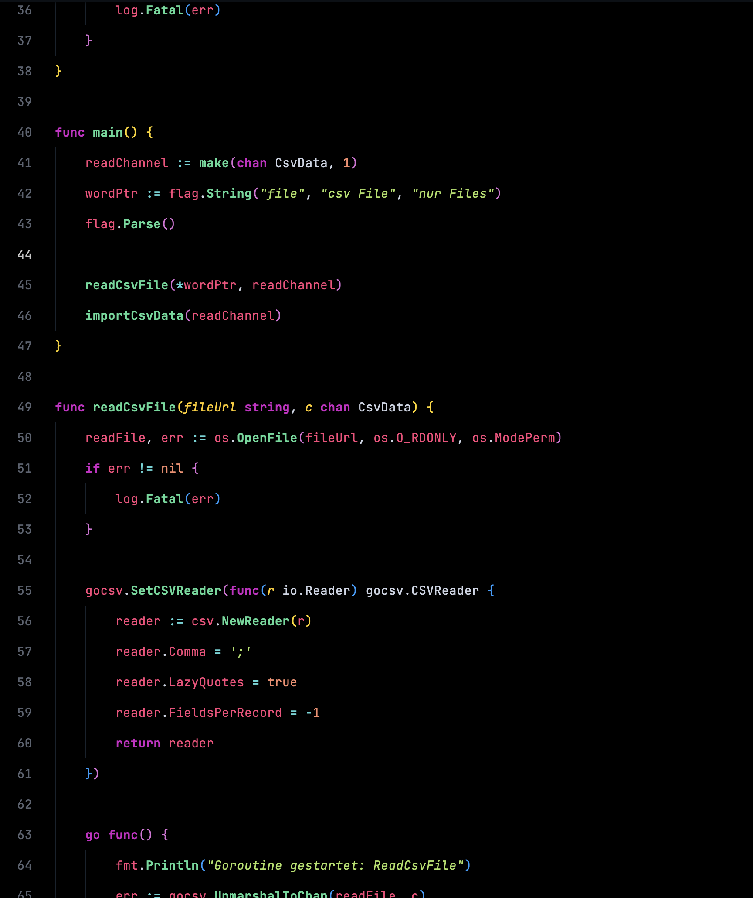
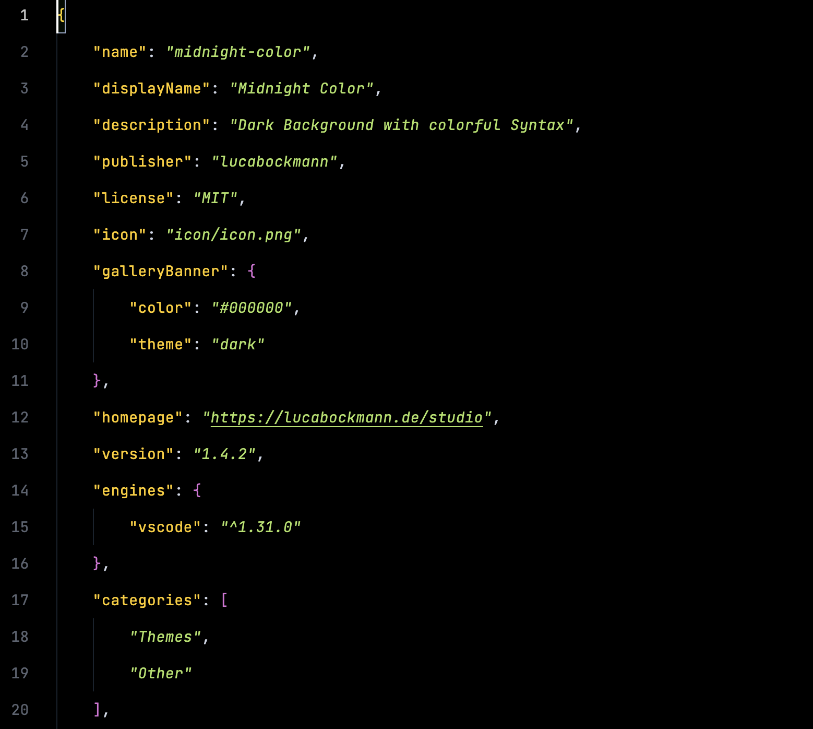
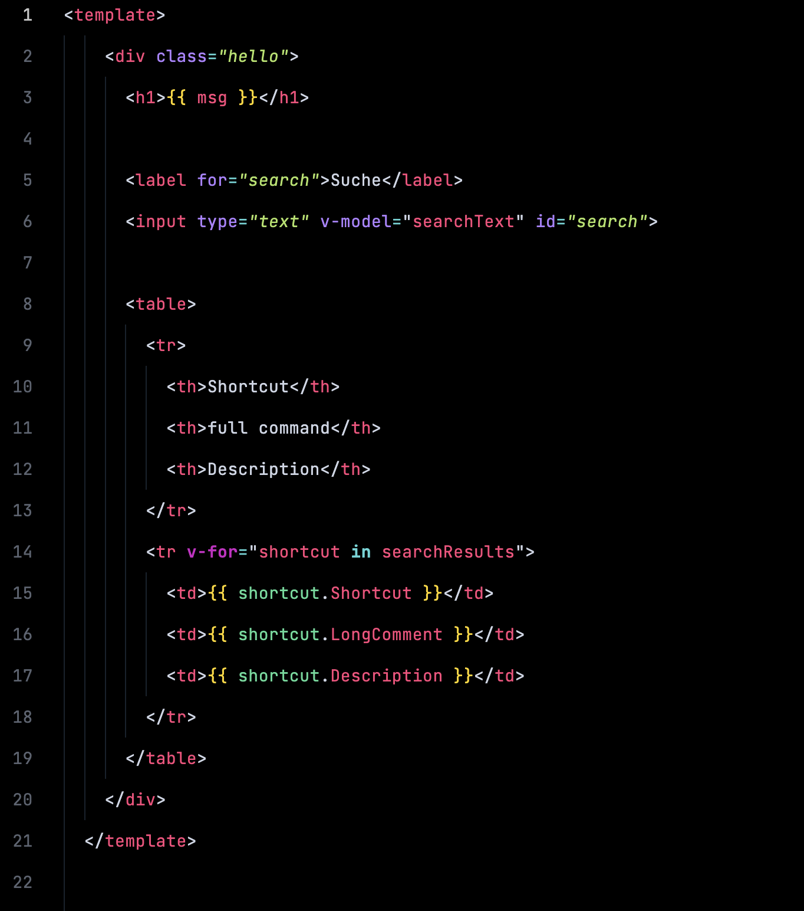
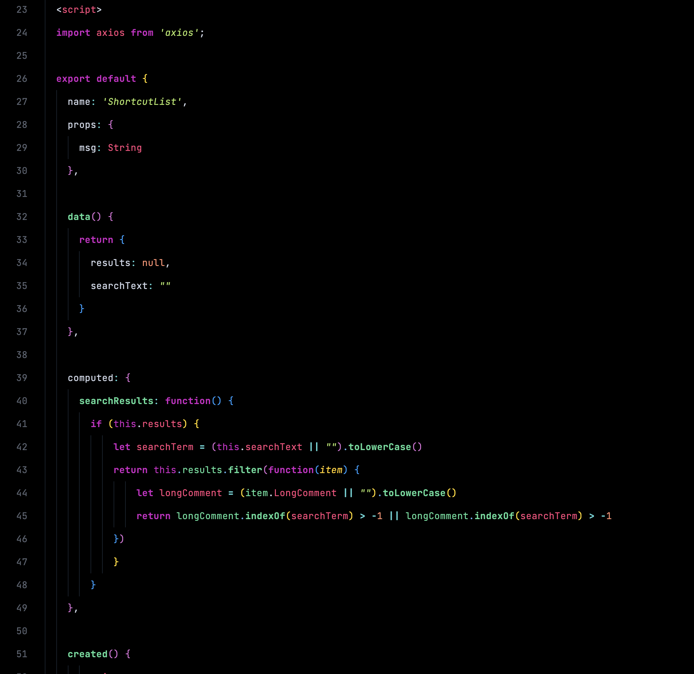

# 🌙 Midnight Color – Code smarter, not harder  

Tired of squinting at your code? **Midnight Color** is here to save your eyes! This dark theme packs bright, high-contrast colors so you can instantly spot what’s what. No more guessing—just clean, sharp syntax that stands out.  

## 🔥 Why you’ll love it:  
✅ **Easy on the eyes** – Dark background, bright colors, zero strain  
✅ **Super clear syntax** – Instantly see functions, keywords & more  
✅ **No distractions** – Just you and your code, nothing else  
✅ **Modern & sleek** – Because your editor should look as good as your code  

Give it a try and level up your coding game! 🚀  

## 👁️ Take a Look

### GoLang

### Json

### VueJs

